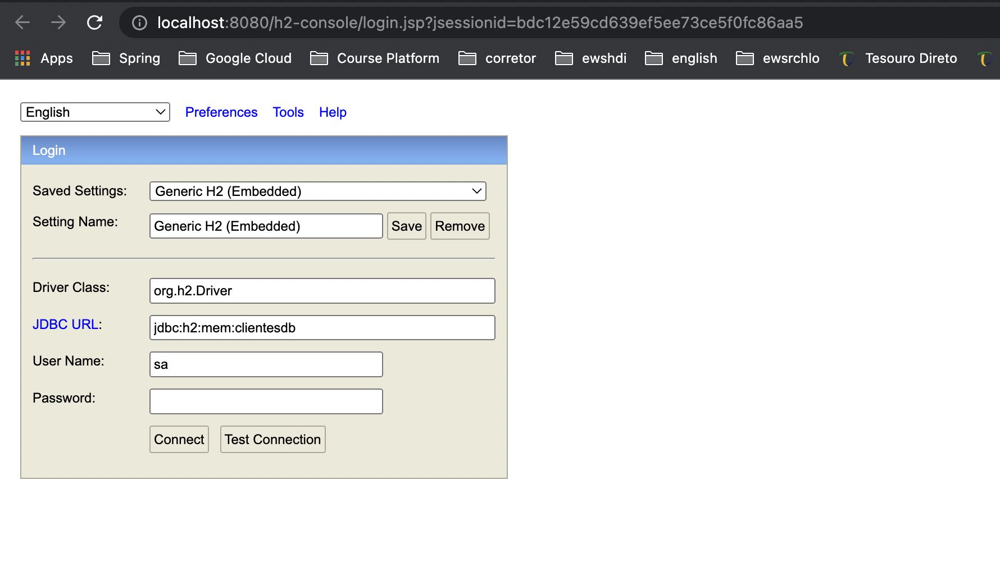
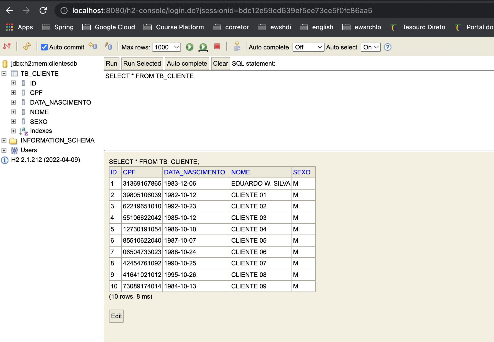
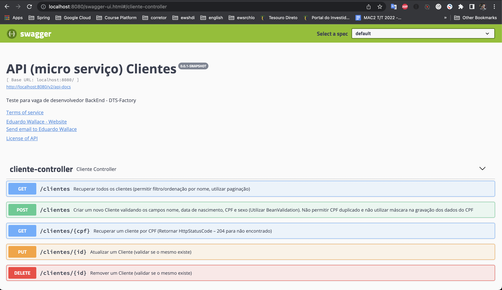

API (micro serviço) Clientes
=============

Aplicação
--

A aplicação contém os seguintes serviços disponiveis:

- Recuperar todos os clientes (permitir filtro/ordenação por nome, utilizar paginação)
 ```
 curl --location --request GET 'http://localhost:8080/clientes?nome=cliente&page=0&size=5&sort=nome,asc'
 ```
- Recuperar um cliente por CPF (Retornar HttpStatusCode – 204 para não encontrado)
 ```
 curl --location --request GET 'http://localhost:8080/clientes/63915501077'
 ```
- Criar um novo Cliente validando os campos nome, data de nascimento, CPF e sexo (Utilizar BeanValidation). Não permitir CPF duplicado e não utilizar máscara na gravação dos dados do CPF.
 ```
 curl --location --request POST 'http://localhost:8080/clientes' \
--header 'Content-Type: application/json' \
--data-raw '{
    "nome" : "Eduardo W. Silva",
    "dataNascimento" : "12/06/1983",
    "cpf" : "313.691.678-65",
    "sexo" : "M"
}'
 ```
- Atualizar um Cliente (validar se o mesmo existe)
 ```
 curl --location --request PUT 'http://localhost:8080/clientes/11' \
--header 'Content-Type: application/json' \
--data-raw '{
    "nome" : "Eduardo Atualizado",
    "dataNascimento" : "12/06/1983",
    "cpf" : "313.691.678-65",
    "sexo" : "M"
}'
 ```
- Remover um Cliente (validar se o mesmo existe)
 ```
 curl --location --request DELETE 'http://localhost:8080/clientes/11'
 ```


Tecnologias Utilidas
--

A aplicação utiliza as seguintes tecnologias:
- Java 17
- SpringBoot2
- JPA/Hibernate
- Swagger
- Junit/Mockito
- Lombok
- H2
- Bean Validation

H2 database
--

Quando a aplicação e inicializada e feito uma carga inicial com alguns clientes, contidos no arquivo data.sql

E possivel acessar o banco H2 através do link [aqui](http://localhost:8080/h2-console)

Segue as imagens abaixo de configuração e acesso:






Swagger e documentações
--
E possivel acessar a documentação Swagger através do link [aqui](http://localhost:8080/swagger-ui.html#/)



Diretrizes
--

Segue o passo a passo de como baixar, compilar e rodar a aplicação.


Passo 01
-----

Clone o seguinte repositorio git com o seguinte comando abaixo:

```
git clone https://github.com/edubossa/gps-cliente-api.git
```

Passo 02
-----

Rode o seguinte comando maven para compilar a aplicação:

```
mvn clean install
```

Passo 03
-----

Rode o seguinte comando para inicializar a aplicação: 

```
java -jar target/gps-cliente-api-0.0.1-SNAPSHOT.jar 
```

Passo 04
-----

Acesse o Swagger da aplicação no seguinte link [aqui](http://localhost:8080/swagger-ui.html#/)
